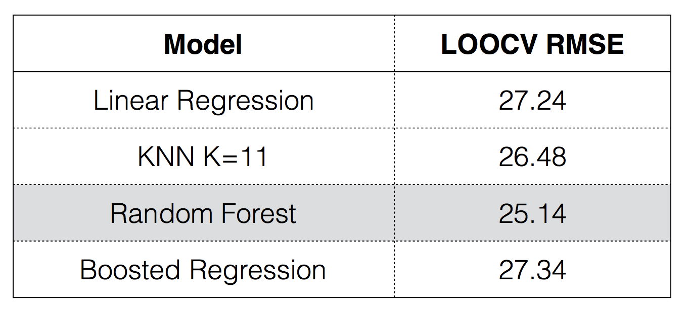

# Predicting blood sugar spikes from personal diet

[project website]: https://heatherhall.github.io/predictingGlucoseSpikesPrelim/

The main purpose of this project was to identify dietary factors that contribute to spikes in blood sugar levels for a pre-diabetic individual. Four models were used to predict height of blood sugar spikes: linear regression, weighted k-nearest neighbor, random forest, and boosted regression. Each model was tuned to optimize the root mean squared error. A description of the analysis methods is given in the [About](https://heatherhall.github.io/predictingGlucoseSpikesPrelim/about.html) page.

![**Figure 1: Representative Day in Data Set** Blood sugar levels are shown varying over a single day with red and blue dots representing spikes and minimums, respectively. The approximate time windows for which dietary information is collected for each blood sugar spike are shown alternating in yellow and purple. As shown, the food entered into the dietary log (shown here with black lines) tends to fall in the windows prior to each blood sugar spike. Note that some spikes have no dietary information, which may be the result of missing diet log information and so these windows were discarded from the models.](docs/figures/cgmExample.png)

# Methods

*For analysis, see links below:*

* [project library](https://heatherhall.github.io/predictingGlucoseSpikesPrelim//0_projectLibrary.html)
* [data preprocessing](https://heatherhall.github.io/predictingGlucoseSpikesPrelim/1_preprocessing.html)
* [feature selection](https://heatherhall.github.io/predictingGlucoseSpikesPrelim//2_featureSelection.html)
* [data mining](https://heatherhall.github.io/predictingGlucoseSpikesPrelim//3_dataMining.html)

# Results

The RMSE is quite high for all models considering the range of blood sugar spikes is 0 to 200 with a median of 54, making this at minimum a 12.5% error and more often upwards of a 50% error. However, given the weak predictors, these models perform quite well and will hopefully improve after more observations are recorded and more uncorrelated features are added to the models.
 

Of the four models built, all perform quite similarly, but Random Forest and KNN (k=11)  perform slightly better. The reported predictions of all models were made by using the  same training and set sets. The training was random 75% sample of the data and the  test set was the remaining 25% of the data. These predictions are reported for all  models in prediction.txt. The most influencial variables in the random forest model can  be seen in below; however, the clinical relevance of these findings may be poor given the high RMSE for the models.

this is a [workflowr](https://github.com/jdblischak/workflowr) project.

